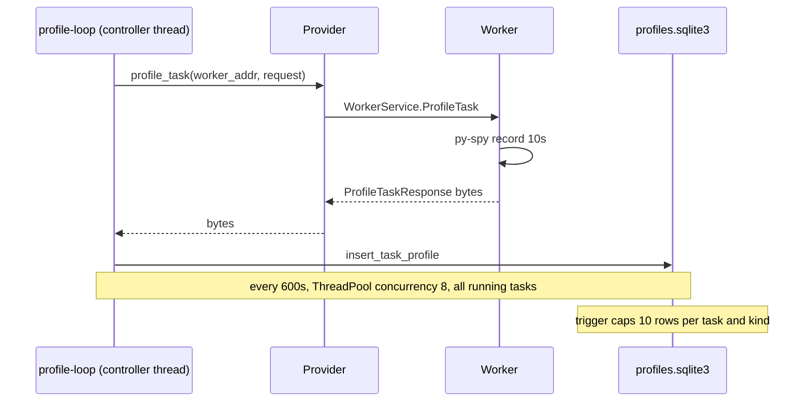
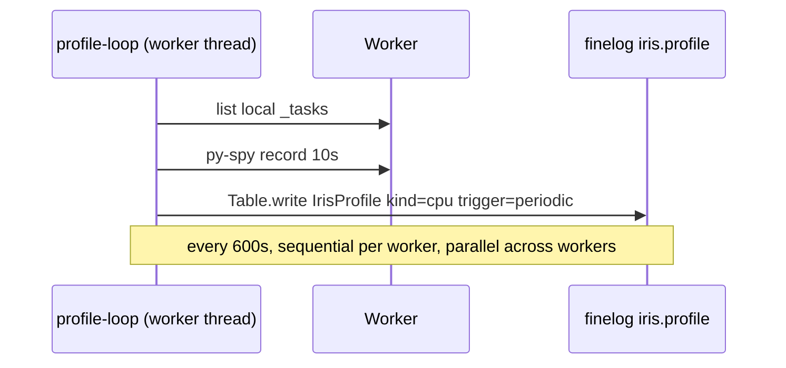
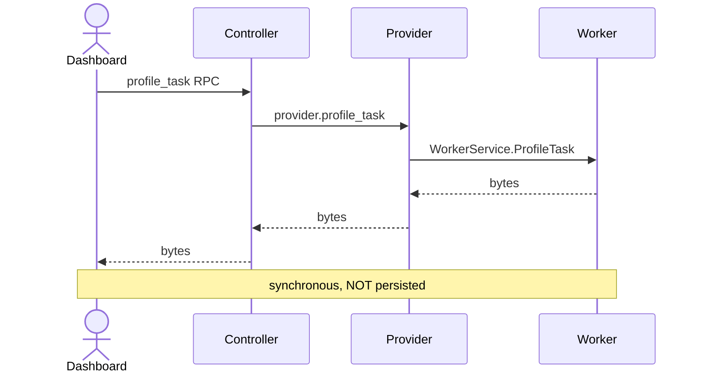
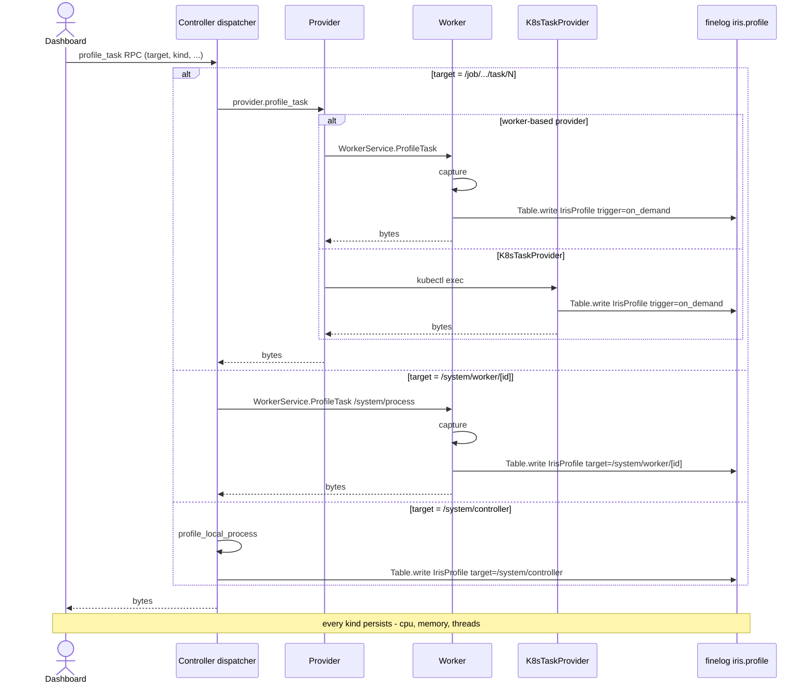
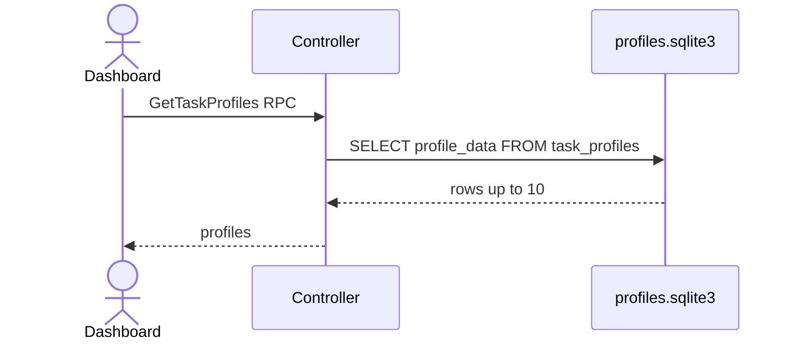
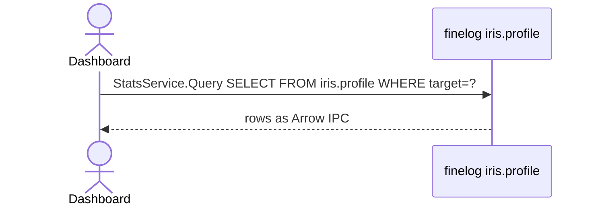

# Iris profiles → finelog

_Why are we doing this? What's the benefit?_

Move profile collection out of the Iris controller and into the workers themselves (and into `K8sTaskProvider` for k8s mode), with profiles persisted in finelog (`iris.profile`) instead of a controller-attached SQLite database. One namespace covers every kind (CPU, memory, threads) and every target (running task, worker process, controller process), discriminated by a `kind` column and a `target` column — the dashboard's "Profile history" panel becomes a single chronological view per target. The controller stops bookkeeping time-series data it does not own — after this lands, the controller DB stores only registry and decisions, while every measurement (utilization, resource samples, profiles) lives in a finelog namespace. This is the same shape as the `iris_stats_migration.md` lift that moved `iris.worker` and `iris.task`; we are finishing the job.

The current controller-side fan-out is also a real bottleneck. On clusters with many workers, the loop dispatches `ProfileTask` RPCs through a bounded `ThreadPoolExecutor(profile_concurrency=8)` ([`controller.py:1663`](https://github.com/marin-community/marin/blob/24ebc3b1/lib/iris/src/iris/cluster/controller/controller.py#L1663)) — at 100+ workers the tail can run minutes behind. With each worker driving its own loop, captures fan out automatically and the central coordinator goes away.

## Background

The controller spawns a `profile-loop` thread that ticks every 10 minutes, fans `ProfileTask` RPCs across all workers, and persists results to `profiles.task_profiles` in an attached SQLite file ([`controller.py:1607`](https://github.com/marin-community/marin/blob/24ebc3b1/lib/iris/src/iris/cluster/controller/controller.py#L1607); [`schema.py:1031`](https://github.com/marin-community/marin/blob/24ebc3b1/lib/iris/src/iris/cluster/controller/schema.py#L1031)). The loop runs only on direct-provider clusters — k8s mode never had periodic profiles ([`controller.py:1344`](https://github.com/marin-community/marin/blob/24ebc3b1/lib/iris/src/iris/cluster/controller/controller.py#L1344)). Workers already write to finelog for stats and already host `WorkerService.ProfileTask` ([`worker.proto:111`](https://github.com/marin-community/marin/blob/24ebc3b1/lib/iris/src/iris/rpc/worker.proto#L111)). The provider abstraction already exposes `provider.profile_task(...)` ([`controller.py:1688`](https://github.com/marin-community/marin/blob/24ebc3b1/lib/iris/src/iris/cluster/controller/controller.py#L1688), [`providers/k8s/tasks.py:1155`](https://github.com/marin-community/marin/blob/24ebc3b1/lib/iris/src/iris/cluster/providers/k8s/tasks.py#L1155)) — worker-based providers forward to the worker; the k8s provider captures via `kubectl exec`. We use that seam: keep the controller's `profile_task` RPC as the dashboard-facing entry, move persistence onto whichever party actually does the capture (worker or k8s provider), and delete only the controller's *periodic loop* and *DB storage*. See `research.md` for the full file:line inventory and the Q&A that fixed the four load-bearing choices (kept on-demand path via finelog, CPU-only auto loop, 7-day retention, dashboard reads via StatsService SQL).

## Architecture

Three flows in each side: the periodic loop, the on-demand "profile now" RPC, and the history view. Three diagrams per side keeps each one readable.

#### Periodic capture

Before — controller fans out to every worker via a bounded thread pool, then writes the bytes to its own SQLite:



After — every worker runs its own loop, captures locally, writes finelog. No controller involvement:



#### On-demand profile-now (dashboard button)

Before — controller dispatches via provider, returns bytes to dashboard, nothing persisted:



After — same dashboard path; the capturer is whichever party holds the ptrace handle, and it writes finelog as a side-effect. Three target families dispatch differently:



#### History view

Before — dashboard reads SQLite via a controller RPC:



After — dashboard reads finelog directly via the existing StatsService SQL surface, filtering by `target`:



The same panel filters task pages on `/job/.../task/N`, the worker page on `/system/worker/[id]`, and the controller status page on `/system/controller`. Workers gain one new thread (`profile-loop`); the controller loses the loop and the table but keeps a thin `_profile_table` write path for its own self-captures.

## Challenges

The worker has never had an autonomous periodic loop — it is fundamentally RPC-driven, with the heartbeat deadline reset by inbound `Ping` / `PollTasks` calls. The 10-minute profile loop is the first wall-clock-driven cron in the worker process. We need a thread that respects the worker's lifecycle (`start` / `stop` / re-register / adopted-without-controller), does not pile up work if the previous round is still running, and tolerates `_log_client = None` modes (test, no-controller-address) without crashing.

The k8s direct-provider path needs care. There is no worker process there to host a loop, and `K8sTaskProvider` runs in the controller process. We do not add a periodic loop on k8s in v1 (matches today). For on-demand on k8s, the K8sTaskProvider already does the capture — it grows a finelog write before returning. That means the controller process is technically the writer for k8s captures, even though the controller no longer hosts a *loop* or *table*. The framing's "remove all vestiges of profiling from the iris controller" applies to collection orchestration and storage; the provider abstraction is the legitimate place for k8s to live.

## Costs / Risks

- **Controller self-profile is preserved**, just relocated to target `/system/controller`. The dashboard button on `StatusTab.vue` keeps working; the controller writes its own row to `iris.profile` and returns bytes inline. (Earlier drafts had this removed; the k8s precedent of "controller process is a legitimate finelog writer" makes keeping it cheap.)
- **ptrace pause cost.** `py-spy record` uses `PTRACE_ATTACH` + stack-walk, which stops the target during sampling. At 10s every 600s that is ~1.7% steady wall-clock overhead, but on a TPU/GPU host with tightly-coupled NCCL collectives the pause can trip stalled-collective warnings or short timeouts. Mitigation: an opt-out attribute on tasks marked latency-sensitive (deferred — see Open Questions).
- **Capture sizing is unmeasured.** Today's `IrisTaskStat` rows are tens of bytes; profile rows are bytes blobs. We expect single-digit GB/day fleet-wide, but raw py-spy output on a JAX worker with hundreds of threads is hundreds of KB per capture, not the tens of KB the SQLite payload sized. We will measure on the dev cluster before enabling fleet-wide and decide on per-row compression then (see Open Questions).
- **No more per-task cap.** Today's SQLite trigger keeps 10 rows per `(task_id, profile_kind)`. Time-based retention will keep *all* captures inside the window — long-running tasks will accumulate ~1000 profiles over 7 days. The dashboard table needs `LIMIT` and a date filter; covered in spec §5.
- **Migration churn for a fourth time.** Fourth move for `task_profiles` (created → fk added → kind added → split DB → now deleted). Justified because the destination is the same finelog backend that already stores `iris.task` and `iris.worker` — the row class joins `IrisWorkerStat`/`IrisTaskStat` in `worker/stats.py`.

## Design

**Worker periodic loop.** A new `_run_profile_loop` thread spawned alongside the existing lifecycle thread, ticking every 10 minutes via the same `RateLimiter` pattern the controller uses today. Each tick iterates `self._tasks`, calls `profile_local_process(duration=10s, profile_type=cpu)` against each running attempt, and writes one row to the `iris.profile` finelog table. CPU profiles run sequentially within a worker by default (one py-spy invocation at a time on the host), with a `profile_concurrency: int = 1` worker config knob to tune for multi-task hosts. Across workers they run in parallel automatically. Per-task exceptions are logged at `exception` level; one flaky task does not skip the rest.

**Dashboard path unchanged.** The dashboard "profile now" button still calls the controller's `profile_task` RPC. The handler resolves the target and delegates:

- `target = "/job/.../task/N"`: dispatched to the task's provider. Worker-based providers forward to the worker via `WorkerService.ProfileTask`; the worker captures, writes to `iris.profile`, returns bytes inline. K8s `K8sTaskProvider.profile_task` captures via `kubectl exec`, writes to `iris.profile`, returns bytes inline.
- `target = "/system/worker/<id>"`: forwarded as `/system/process` to the named worker via `WorkerService.ProfileTask`; worker captures itself, writes finelog with `target` set back to `/system/worker/<id>` so the dashboard can find it, returns bytes.
- `target = "/system/controller"` (renamed from today's `/system/process` on the controller): controller captures its own process via `profile_local_process`, writes to `iris.profile` directly, returns bytes. The k8s provider already established the precedent that the controller process is a legitimate finelog writer; this is the same pattern.

**All kinds persist.** CPU, memory, and threads captures all write to `iris.profile`. The dataclass carries a `kind: str` column ("cpu" | "memory" | "threads"), a `target: str` column (the resolved profile target), and per-kind optional metadata (CPU's `rate_hz` and `native`, memory's `leaks`, threads' `locals_dump`). On-demand captures persist whichever kind was requested; the periodic worker loop only writes `kind="cpu"`.

**Single writer per side.** The worker's `_capture_and_log_profile` helper is the only finelog writer on workers, called by the periodic loop and by the worker's `ProfileTask` RPC handler for every kind. The k8s provider has its own writer inside `K8sTaskProvider.profile_task`. The controller has its own writer for `/system/controller` only.

```python
# lib/iris/src/iris/cluster/worker/profile_loop.py (new)
def run_profile_loop(*, stop_event, interval, list_running_attempts, capture_one):
    limiter = RateLimiter(interval_seconds=interval.to_seconds())
    while not stop_event.is_set():
        if (delay := limiter.time_until_next()) > 0:
            stop_event.wait(timeout=delay)
            if stop_event.is_set(): break
        limiter.mark_run()
        for attempt in list_running_attempts():
            try:
                capture_one(attempt, trigger="periodic")
            except Exception:
                logger.exception("profile capture failed for %s", attempt.task_id)
```

**Finelog namespace.** `iris.profile` with row class `IrisProfile(key_column="captured_at")` — fields: `target, attempt_id, worker_id, captured_at, duration_seconds, kind, format, trigger, rate_hz, native, leaks, locals_dump, profile_data`. `kind` (`cpu|memory|threads`), `format` (`raw|flamegraph|speedscope|html|table|stats`), `trigger` (`periodic|on_demand`) follow the `StrEnum` convention used by `WorkerStatus` in `stats.py:32`. The four kind-specific metadata fields (`rate_hz`, `native`, `leaks`, `locals_dump`) are nullable and only populated for the kind that uses them. Registered eagerly at worker / k8s-provider / controller start via `LogClient.get_table` so schema mismatches surface on first ping. Retention: 7 days, configured via finelog's standard per-namespace TTL and documented in `OPS.md`.

**Controller deletions.** What goes: `_run_profile_loop`, `_profile_all_running_tasks`, `_dispatch_profiles`, `_capture_one_profile`, `_profile_thread`, the three `profile_*` periodic-loop config knobs, the `task_profiles` table, the attached `profiles` SQLite database, and `insert_task_profile` / `get_task_profiles`. Migrations 0005/0014/0020/0023 stay on disk as no-op chain links (collapsing them is a separate cleanup); a new `0024_drop_profiles_db.py` `DETACH`-es and `unlink`-s the file. What stays: the controller's `profile_task` RPC handler — but rewritten to dispatch via provider for task targets, forward to worker for `/system/worker/<id>`, and capture-locally-then-write-finelog for `/system/controller`.

**K8s mode.** `K8sTaskProvider.profile_task` adds a finelog write to `iris.profile` on CPU success before returning bytes. No periodic loop on k8s in v1 (matches today; flagged in Open Questions for follow-up).

**Dashboard.** "Profile now" button is unchanged — keeps calling controller `profile_task`, which now silently delegates through the provider abstraction. Add a "Profile history" panel on `TaskDetail.vue` running `SELECT captured_at, attempt_id, format, trigger, length(profile_data) FROM "iris.profile" WHERE task_id = ? ORDER BY captured_at DESC LIMIT 50` through `useStatsRpc`. Clicking a row downloads `profile_data` via a second targeted SQL. Drop the "profile this controller" button on `StatusTab.vue` (no controller self-profile path remains).

**Commit ordering.** Each commit independently revertable, tests green at every step:
1. Introduce `IrisCpuProfile` schema + namespace registration in `Worker.start()`. No writers yet — table exists but is empty.
2. Worker `ProfileTask` RPC handler writes to `iris.profile` on CPU-task success; `K8sTaskProvider.profile_task` does the same. On-demand captures now persist; periodic captures still go through the controller loop into `task_profiles`. Dual-write window.
3. Add worker `_run_profile_loop`. Add "Profile history" panel on `TaskDetail.vue`. Periodic captures land in finelog.
4. Delete controller `_run_profile_loop` / helpers / config / DB helpers, the prune sweep (`profile_retention` config, `prune_old_data` arg, `prune_stale_profiles` / `prune_orphan_profiles` store helpers, `PruneResult.profiles_deleted`), and the checkpoint snapshot/restore branches that include `profiles.sqlite3`. Strip the controller `profile_task` RPC handler down to "dispatch via provider; return bytes." Drop the `task_profiles` table and `profiles.sqlite3` via migration `0024_drop_profiles_db.py`. **All of these must land in one commit** — splitting the prune deletion from the migration crashes the controller on the next 1h tick.
5. Document in `lib/iris/AGENTS.md` and `OPS.md`.

## Testing

- **Unit:** `run_profile_loop` (advances on a clock; skips non-running attempts; swallows per-attempt failures; stops promptly between captures); worker `ProfileTask` handler's finelog write (uses `MemoryLogNamespace`); `_log_client = None` mode skips cleanly.
- **Integration:** end-to-end on the iris dev cluster — submit a long-running task, wait one tick, query `iris.profile` via StatsService, assert ≥1 row with non-empty `profile_data`. Run on both old-controller-with-new-workers and full-cluster-restart configurations. Add a k8s-provider integration test verifying on-demand still works through `controller.profile_task → K8sTaskProvider.profile_task` and produces a finelog row, and that no periodic rows appear (since the k8s loop is intentionally not added).
- **Migration:** `0024_drop_profiles_db.py` deletes `profiles.sqlite3` exactly once; tolerates re-runs and missing files. Profile data is diagnostic, not load-bearing — no backup.
- **No regression:** `iris.task` / `iris.worker` stats tests must keep passing.

## Open Questions

- **Capture size + compression.** Production py-spy raw output on JAX workers can be hundreds of KB per capture. Should we per-row gzip in the worker before writing (5-line change), rely on parquet block compression (low gain — bytes are mostly distinct), or measure on dev first and decide? Default plan: measure first.
- **Profile interval source.** Per-worker config knob (today's plan) vs. controller-pushed via `Ping.profile_interval` (one fleet-wide value). The latter is one extra proto field; the former is simpler but drifts across worker restarts.
- **Per-target circuit breaker.** Today the loop retries forever even if py-spy fails on the same attempt every tick. Add a per-`(target, attempt_id)` failure counter that backs off after N consecutive failures, or accept the noise?
- **`worker_id` value space.** This column now mixes writer kinds: a worker's ID for task captures by workers, `controller-self` for `/system/controller`, the named worker's ID for `/system/worker/<id>`, and `k8s/<node-or-pod>` for k8s. Confirm reviewers are OK with the mixed semantics, or rename to `writer_id`.
- **Latency-sensitive opt-out.** Should tasks declare a `no-profile` attribute (e.g., on the JobConfig)? Tightly-coupled NCCL workloads may want to.
- **K8s periodic profiling.** Should the K8sTaskProvider grow its own loop writing to finelog from the controller process, or stay on-demand-only as today?
