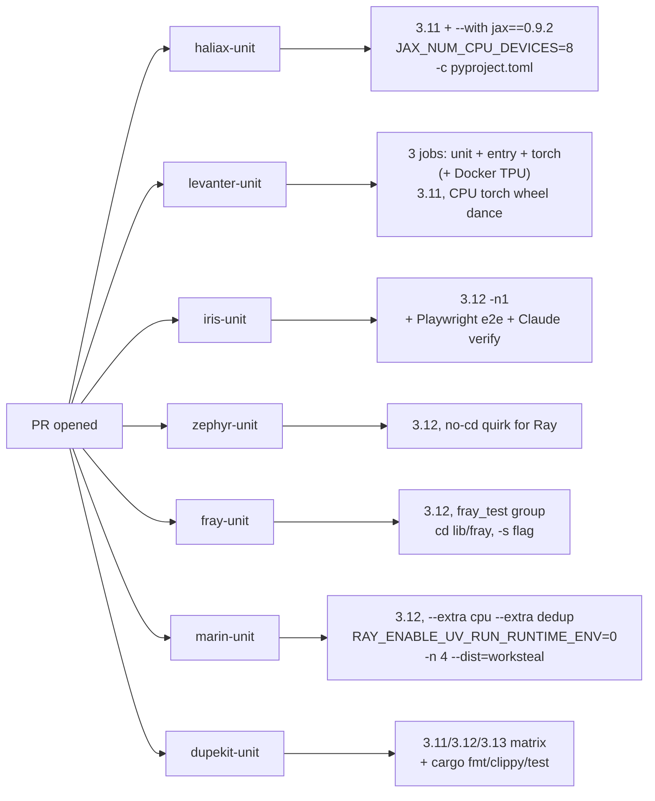

# Unified Unit-Test Workflow

_Why are we doing this? What's the benefit?_

We have seven `*-unit.yaml` workflows
(`.github/workflows/{haliax,levanter,iris,zephyr,fray,marin,dupekit}-unit.yaml`)
that each encode the same shape — `dorny/paths-filter` → `uv sync` →
`pytest` — with sharp per-workspace-member divergence in install
commands, env vars, marker filters, and working directories. The path
filters under- or over-approximate the real import dependencies, and
adding a new workspace member requires authoring (and forgetting to
update) yet another YAML. We already have an analyzer
(`infra/select_tests.py`) that computes a precise test matrix from any
diff, with a top-level-only AST filter that respects the codebase's "no
lazy imports" convention. The next step is to delete the per-member
YAMLs and let one orchestrator drive all unit tests, with a small set
of defaults baked in workspace-wide and a tiny `[tool.marin.tests]`
table only in those packages that genuinely diverge.

End state: `marin-unit.yaml` + `marin-integration.yaml` cover the python
lib packages; `dupekit-unit.yaml` keeps the Rust+Python hybrid;
`levanter-tpu-tests.yaml` extracts the Docker-TPU job. Five workflow
files deleted, one rewritten.

This is also a **cleanup pass.** Several of the per-member quirks I
catalogued turn out to be cruft, not real differences — Ray was removed
from the codebase (so `RAY_ENABLE_UV_RUN_RUNTIME_ENV=0` and the
"don't-cd-zephyr" rationale are dead), iris doesn't actually need
`-n1`, packages have drifted onto different Python versions for no real
reason, test deps are split across `dev` / `test` / `fray_test` groups
inconsistently. The design deletes those before encoding the rest (see
`spec.md` §7).

## Background

### Terminology (used throughout)

- **Workspace member** — one directory under `lib/`. Marin has 8:
  rigging, finelog, haliax, iris, fray, levanter, zephyr, marin. Each
  is a uv workspace member declared in `pyproject.toml [tool.uv.workspace]`
  and named `marin-<dir>`.
- **Module** — a Python module name resolved from a source file. E.g.,
  `lib/levanter/src/levanter/store/cache.py` → `levanter.store.cache`.
- **Test file** — a file under `lib/<member>/tests/` (or top-level
  `tests/` for the marin scope) that pytest collects.
- **Leg** — one entry in the orchestrator's matrix; one `pytest`
  invocation against one workspace member's selected tests.

**Selection happens at the test-file level** (which files pytest runs).
**Dispatch happens at the workspace-member level** (one leg per member
that has any selected test). **Traversal happens at the module level**
(the analyzer's reverse-dep BFS walks dotted module names).

### Today's state



Path-filter audit: five of seven workflows have under-approximated
filters. A change to `rigging.timing` (top-level imported by every
other workspace member) only fires `rigging-unit`, even though it can
break finelog/iris/fray/zephyr/levanter/marin. A change to
`iris.cluster.controller.autoscaler.runtime` (transitively reaches
fray → zephyr → levanter → marin via real top-level chains) only fires
`iris-unit`. The CI is silent on cross-member regressions.

Prior art (Bazel `py_test`, Pants `python_tests`, Nx `project.json`,
Turborepo `turbo.json`) all converge on declarative per-target config,
but every one of them lets the *baseline* do the work — per-target
config is for what differs, not what's the same. Coverage-based test
selection (testmon-style) loses on cache-invalidation. Full digest in
`research.md`.

## How the analyzer picks tests

`infra/select_tests.py` already produces `{run_all: bool, matrix:
list[{package, tests}]}` from the diff against a base ref:

```mermaid
flowchart TB
    diff[git diff vs base ref<br/>list of changed files] --> classify[Classify each path]
    classify --> broad{broad trigger?<br/>uv.lock / root pyproject /<br/>infra/select_tests.py}
    broad -->|yes| runall[full-suite matrix:<br/>every member, tests=&#91;&#93;]
    broad -->|no| route["Route by path:<br/>lib/X/src/a/b.py → module 'X.a.b'<br/>lib/X/tests/t.py → direct test<br/>lib/X/conftest.py → forced full X<br/>workflow file → forced full owning member"]
    route --> grimp[grimp.build_graph<br/>over lib/*/src/<br/>~540 modules total]
    grimp --> ast["AST-scan each src file<br/>collect TOP-LEVEL imports only<br/>skip def/class bodies<br/>skip if TYPE_CHECKING blocks"]
    ast --> downstream[BFS reverse-deps:<br/>changed module → affected modules]
    downstream --> testscan["AST-scan each test file<br/>select if any import touches<br/>the affected set"]
    testscan --> grouped[group selected tests by<br/>owning workspace member]
    grouped --> out[matrix: per-member test list]
```



**Why top-level imports only?** Per AGENTS.md, lazy imports (`from foo
import bar` inside a `def`, `class`, or `if TYPE_CHECKING:` block) are
reserved for breaking cycles or guarding optional deps; they don't
impose a load-time dependency, so they shouldn't propagate test impact.
Without this filter, a single lazy `from fray.device_flops import ...`
inside `fray.types.GpuConfig.device_flops()` was making device_flops
look like it cascaded to 150+ modules. With it, the cascade stops at
the genuine top-level coupling — `levanter.callbacks._metrics` being
the only top-level importer of device_flops.

### Concrete worked example

A one-line change to `lib/levanter/src/levanter/store/cache.py`. Run
against the current worktree, the analyzer outputs:

```json
{
  "run_all": false,
  "reason": "diff-driven",
  "matrix": [
    {"package": "levanter", "tests": [
        "lib/levanter/tests/test_audio.py",
        "lib/levanter/tests/test_dpo.py",
        "lib/levanter/tests/test_new_cache.py",
        "lib/levanter/tests/tiny_test_corpus.py",
        "lib/levanter/tests/whisper_test.py"
    ]},
    {"package": "marin", "tests": [
        "tests/datakit/test_datakit.py",
        "tests/integration_test.py",
        "tests/processing/tokenize/test_tokenize.py",
        "tests/test_consolidate_metadata.py",
        "tests/test_data_configs.py",
        "tests/test_download_pretokenized.py",
        "tests/test_grug_checkpointing.py"
    ]}
  ]
}
```

Two legs, 12 test files. **Today**, that same change runs the entire
levanter test suite (~95 files) plus the entire marin test suite (~62
files) — `lib/levanter/**` is in both filters. The analyzer drops to
~12 actually-affected tests.

Notice what's *not* selected: `lib/zephyr/tests/test_writers.py`. A
naïve grep would call out `zephyr/writers.py` as a downstream consumer
of `levanter.store.cache` — but the import there is **inside a
function body** (lazy, line 459), not top-level. The top-level filter
correctly excludes it: if `levanter.store.cache`'s public types
change, zephyr's writer continues to *load* fine; only its `def
write_levanter_cache(...)` body would fail at call time.

This particular lazy import is on the chopping block already — there's
a parallel cleanup happening to remove the remaining lazy imports
across the workspace (most are vestigial, kept around for cycles that
no longer exist). Once that lands, the same change would reach
`zephyr.writers` and add `lib/zephyr/tests/test_writers.py` to the
matrix. The analyzer doesn't need to change — it correctly reflects
whatever the source actually does.

## Design

**Workspace baseline in the root `pyproject.toml`** (one place, owns
Python version, default markers, default pytest args, default `uv sync
--group test`):

```toml
[tool.marin.tests.workspace]
python = "3.12"
markers = "not slow and not tpu and not tpu_ci"
pytest_args = ["--durations=5", "-n", "auto", "--tb=short"]
sync_groups = ["test"]
```

**Per-member overrides** are optional. Most members need no table.
Only the genuinely-different ones declare a `[tool.marin.tests]` in
their `lib/<pkg>/pyproject.toml`:

```toml
# lib/levanter/pyproject.toml
[tool.marin.tests]
sync_extras = ["torch_test"]
sync_extra_args = ["--no-install-package", "torch"]
setup_scripts = ["infra/test_setup/install_torch_cpu.sh",
                 "infra/test_setup/install_ffmpeg_apt.sh"]
setup_node = "22"
```

After Phase 0 cleanup the actual per-member configs are tight:
**four members need no table at all** (rigging, finelog, zephyr,
fray), **three or four carry a small delta** (iris, levanter, marin,
and possibly haliax — its JAX `--with` pin is on the chopping block),
**zero declare a Python version, working directory, or sync group**
(workspace pins one Python; everyone runs from repo root; everyone
syncs with `--group test`). Full table in `spec.md` §4.

**Single orchestrator: `marin-unit.yaml`.** Three jobs, with
`fail-fast: false` and a workflow-level `concurrency: marin-unit-<pr>`
that cancels in-flight runs on push:

```mermaid
flowchart LR
    PR2[PR opened] --> select["select job<br/>~30s<br/>uv sync --group dev<br/>python infra/select_tests.py<br/>--emit-github-output"]
    select --> empty{empty matrix?}
    empty -->|yes| done["aggregate: skip<br/>marin-unit ✓"]
    empty -->|no| unit["unit job<br/>strategy.matrix.include"]
    unit --> leg1[leg: rigging]
    unit --> leg2[leg: levanter<br/>tests=&#91;...4 files...&#93;]
    unit --> leg3[leg: marin<br/>tests=&#91;...2 files...&#93;]
    leg1 --> agg[aggregate]
    leg2 --> agg
    leg3 --> agg
    agg --> done2["marin-unit status<br/>(single required check)"]
```



Each leg invokes `infra/run_tests.py prepare <package>`, which loads
the resolved `TestsConfig` (workspace baseline merged with any
per-member override) and writes two scripts to `$RUNNER_TEMP/leg/`
(setup.sh and pytest.sh) — outputs only carry scalars (sync args,
env-as-`KEY=VAL` lines). The leg sets up Python via `uv python
install`, optionally runs `actions/setup-node`, lifts env into
`$GITHUB_ENV`, runs setup.sh, `uv sync ...`, then pytest.sh. Always
from repo root; no `cd`. If the analyzer's `tests` list is non-empty,
pytest runs on that explicit list (precise); empty list = forced full
suite for that member.

The "writes scripts to a temp dir" pattern is deliberate: GitHub
Actions step outputs cannot reliably carry multi-line shell, and
levanter's CPU-torch wheel install is genuinely a 25-line heredoc.

**`marin-integration.yaml` absorbs `iris-e2e-smoke`.** Playwright +
Claude-screenshot-verification isn't unit-shaped (boots a server,
drives a real browser, calls an external API). `dupekit-unit.yaml`
stays as-is — Rust+Python hybrid doesn't fit the analyzer.
`levanter-tpu-tests.yaml` extracts the Docker-TPU job from
`levanter-unit.yaml:159-227` unchanged; folds into the unified policy
later when it can run on the Iris prod cluster.

**Sub-suites collapse.** Levanter's three Python sub-jobs (unit /
entry / torch) become one matrix leg with one marker filter. The
AST-driven test selection is the safety net the marker-split used to
be: a torch-only test only fires when its imported source appears in
the affected set.

## Improvements over today

1. **Correctness.** Today five of seven workflows have
   under-approximated path filters; cross-member regressions are
   invisible to CI. After: the analyzer's import graph (built from real
   Python source, not hand-maintained YAML) is the source of truth.
2. **Precision.** Today *any* change inside `lib/levanter/**` runs all
   ~95 levanter tests, even a docstring edit. After: only tests whose
   top-level imports reach the changed module run. Average test count
   per PR drops sharply on small changes; the worked example above goes
   from ~157 tests to ~7.
3. **Maintainability.** Adding a new workspace member: today, a whole
   new YAML with copy-paste path-filter / uv-sync / pytest stanzas.
   After: a row in `SCOPE_TO_PYPROJECT` and (maybe) a small
   `[tool.marin.tests]` table.
4. **Accumulated cruft deleted.** Phase 0 removes Ray refs, iris's
   `-n1`, the haliax JAX runtime pin (pending review), `-c
   pyproject.toml` redundancy, Python-version drift, and inconsistent
   dependency-group names.
5. **Schema discipline.** Workspace baseline owns the boring stuff.
   Most members need no `[tool.marin.tests]` at all; the design doesn't
   pay for what it doesn't use.
6. **Single required status check.** Branch protection requires
   `marin-unit` (one), not seven separate names.

## Challenges

**Avoiding scope creep into "preserve everything verbatim."** The
seven workflows have accreted quirks over time and several of them no
longer matter. The temptation is to encode all of them as schema
fields. The right move is to delete what's dead first and let the
schema only carry differences that are actually load-bearing.

**The orchestrator is on the critical path for every PR.** Today, six
of the seven workflows skip themselves entirely if the path filter
doesn't match in ~5 seconds. The new orchestrator runs analyzer +
matrix-emit on every PR, including docs-only ones. The analyzer takes
~3s once `uv sync --group dev` has installed `grimp`; the matrix can
be empty so the wall-clock cost on a docs-only PR is `uv sync` + 3s.
That's a real ~30–60s floor regression on docs-only PRs.

## Costs / Risks

- **Migration churn.** Five workflow files deleted, one rewritten,
  six small Phase 0 cleanup PRs land first. Branch-protection rules
  currently name jobs like `levanter-unit` / `iris-unit`; an admin
  must remove those and add the new `marin-unit` aggregate as a
  required check (sequenced — see `spec.md` §10).
- **`grimp` is a hard CI dependency now.** If the analyzer fails (a
  transitive import error, a malformed package) every PR's unit tests
  are dead. The pressure-relief is a `--force-run-all` flag on
  `select_tests.py` plus a `workflow_dispatch` input on
  `marin-unit.yaml` so a human can bypass the analyzer in a panic.
- **Cold-start floor on every PR.** ~30–60s `uv sync --group dev` +
  grimp graph build, even when the resulting matrix is empty. Net
  regression on docs-only PRs.
- **Levanter sub-suite parallelism is lost.** Today `levanter-unit`,
  `levanter-entry`, and `levanter-torch` run on three runners
  concurrently; collapsed into one matrix leg they serialize. The
  AST-driven test selection covers correctness; the loss is wall-clock
  on PRs that touch most of levanter.

## Testing

The analyzer is already covered by 25 unit tests in
`tests/infra/test_select_tests.py`. Two new test surfaces:

- **A baseline + override resolution test.** Loads the workspace
  baseline and each member's optional `[tool.marin.tests]`, asserts
  required fields are present, types check, and the merged
  `TestsConfig` is what we expect for known members
  (`tests/infra/test_marin_tests_config.py`). Failing this test in CI
  prevents merging a malformed table or a missing baseline.
- **Renderer test.** Asserts the shell scripts produced by
  `infra/run_tests.py prepare <pkg>` for fixture configs match
  expected content (`tests/infra/test_run_tests.py`).

Migration is staged so each phase is reversible until the last (full
detail in `spec.md` §10): six Phase 0 cleanup PRs delete the cruft
first; Phase 1 lands the orchestrator behind `continue-on-error`;
Phase 2 makes it a non-required parallel check next to the old
workflows; Phase 3 deletes the old workflows in a single PR and an
admin updates branch-protection in three steps.

## Open Questions

- **Phase 0 scope.** `spec.md` §7 lists six cleanup steps the design
  treats as obvious wins (Ray refs gone, `-n1` gone, Python unified at
  3.12, every package's test deps move to a uniform `test` group,
  haliax JAX `--with` re-evaluated, redundant `-c pyproject.toml`
  gone). Anything in that list someone wants to defend?
- **haliax's runtime JAX pin.** `--with "jax[cpu]==0.9.2"` overrides
  the lockfile. Is this an intentional "test haliax against the JAX
  version levanter uses" check? If yes, tighten the dep in
  `lib/haliax/pyproject.toml` and drop the override. If no, just drop
  it. If neither and reviewers want it preserved, `uv_run_args` carries
  it.
- **Cold-start cost on docs-only PRs.** ~30–60s floor on every PR. Worth
  it for the precision wins, but I want a sanity check that the docs-PR
  experience won't deteriorate enough to bother people.
- **Branch-protection runbook.** Phase 3 needs a three-step admin
  sequence (remove old required checks → merge switch PR → add new
  required check). Should this happen with someone in the room, or do
  we trust the runbook?
- **Should the analyzer become a reusable composite action?** Inline in
  the orchestrator keeps blast radius small; composite would let other
  workflows consult the matrix. Starting inline; reconsider if a second
  consumer shows up.
